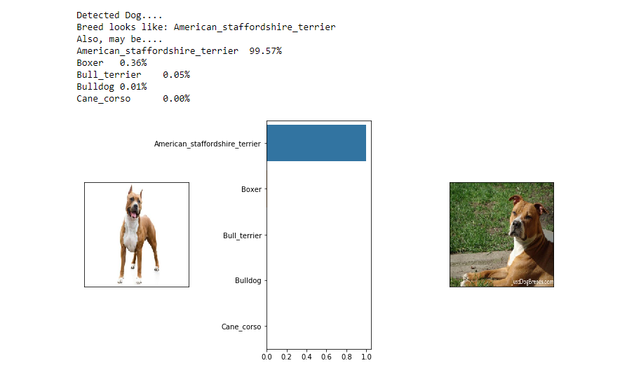
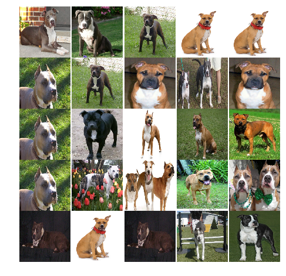
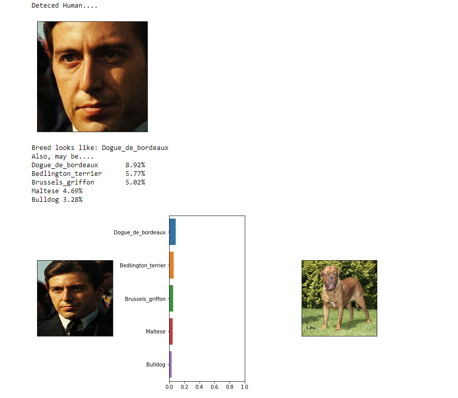
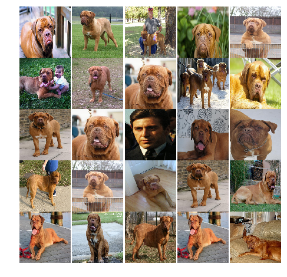

# Deep Learning - CNN - Classify Dog Breed for given image

This is CNN implementation of classify dog breed for given images, Model accepts any user-supplied image as input. 
If a dog is detected in the image, it will provide an estimate of the dog's breed. 
If a human is detected, it will provide an estimate of the dog breed that is most resembling 

Below are some samples of classify dog breeds:

1. Deteced Dog

2. Deteced Human

There are 3 main parts of this model:

1. **Analyzing Images**: Detecting Human faces with CV2 and DBLib, Detecting Dog with VGG-16, ResNet-50 and Inception_V3

2. **CNN Model**: Custom CNN Model - 1024 Conv2D - Build Custom CNN model, train and classify dog breeds

3. **Transfer Learning**: ResNet-50 - Create RestNet-50 model, only train fully Connected Layer and classify dog breads

## Repository 

This repository contains:
* **dog_breed_classification_app.ipynb** : Complete code for detecting dog, human faces in image, custom CNN model and ResNet-50 Transfer Learning Model to classify dog breeds, and visualizing classification results
					  
## Datasets

Datasets necessary for this implementation can be downloaded by clicking 
[Dog Dataset](https://s3-us-west-1.amazonaws.com/udacity-aind/dog-project/dogImages.zip)  

[Human Dataset](https://s3-us-west-1.amazonaws.com/udacity-aind/dog-project/lfw.zip)

## List of Hyperparameters used:

1. Custom CNN Model
	* Model = **1024 Conv2d Model**
	* Number of Fully Connected Layer = **2**  
	* Fully Connection Layers = **2**  
	* Batch Size = **32**  
	* Epoch = **20**  

	* Loss Function = **CrossEntropyLoss**  
	* Optimizer  = **SGD**  
	* Initial Learning Rate, Momentum = **0.002, 0.9**  

2. CNN Transfer Learning Model
	* Model = **ResNet-50**
	* Trained Layer = **Only Fully connected Layer since dataset is small and similer to original training data**  
	* Number of Fully Connection Layers = **2**  
	* Batch Size = **32**  
	* Epoch = **15**  

	* Loss Function = **CrossEntropyLoss**  
	* Optimizer  = **Adam**  
	* Initial Learning Rate = **0.001**  

